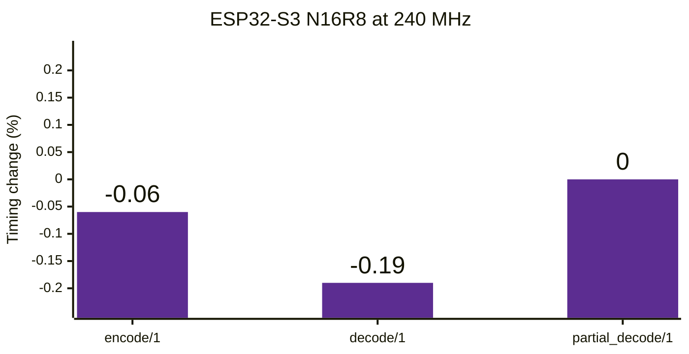
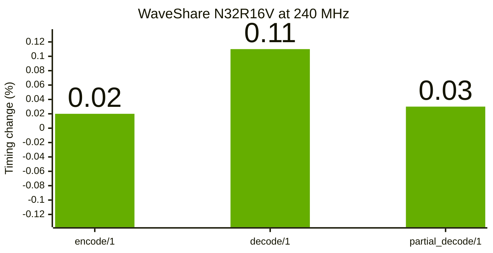
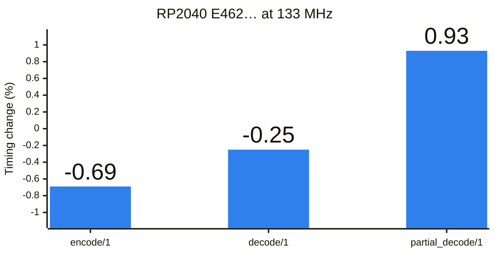

# atomvm-cbor

<p>
  <a href="https://github.com/Atelje-Vagabond/atomvm-cbor/actions/workflows/release-gate.yml"></a>
  <a href="https://github.com/Atelje-Vagabond/atomvm-cbor/blob/main/docs/benchmarks.md"></a>
  <a href="LICENSE"></a>
  <a href="https://www.erlang.org/"></a>
  <a href="https://www.atomvm.net/"></a>
  <a href="https://buymeacoffee.com/ateljevagabond"></a>
</p>

A compact RFC 8949 CBOR encoder and decoder for AtomVM and constrained Erlang runtimes. It is pure Erlang, has no runtime dependencies, NIFs, or ports, and preserves the public `{text, Binary}` and `{map, Pairs}` representations.

Version 0.3.0 adds bounded descriptor traversal, selective extraction, sequence
encoding/folding, exact-size encoding, and complete-input validation. Version
0.2.0 was the first Hex.pm release; public Git tag `v0.1.1` was never published
to Hex.

## Current release

<!-- release-evidence:readme-current-release:start -->
Representative attached-device benchmark changes from 0.2.0 to 0.3.0. Negative is faster; positive is slower. Chart labels are percentages rounded to two decimal places; exact timings follow in the benchmark table.






<!-- release-evidence:readme-current-release:end -->

## Installation

Rebar3 projects use the OTP application name `avm_cbor` and Hex package name `atomvm_cbor`:

```erlang
{deps, [
    {avm_cbor, "~> 0.3.0", {pkg, atomvm_cbor}}
]}.
```

Mix projects use:

```elixir
{:avm_cbor, "~> 0.3.0", hex: :atomvm_cbor}
```

## Capabilities

- All CBOR major types, UTF-8 validation, semantic-tag passthrough, and half/32/64-bit float decode.
- Definite and bounded indefinite-length strings, arrays, and maps.
- Preferred serialization and deterministic encoding/validation under explicit options.
- Duplicate-map-key rejection and encoded-key ordering checks in deterministic decode.
- Full decode, pull-based continuation decode, complete-input decode, bounded
  CBOR sequence encode/decode/fold, and deferred partial decode.
- Single-pass partial map/array folds, selective map lookup, and indexed array
  access without deep-decoding unselected values.
- Depth, node, input-byte, per-string, cumulative-string, and partial-string limits.
- Structured errors for malformed, truncated, unsupported, and resource-bound inputs.
- OTP 25+ and AtomVM 0.6.6 compatibility.

## Attached-device benchmarks

The exact public `0.2.0` and `0.3.0` tags were measured on the same three
physical devices with AtomVM 0.6.6, identical firmware and harness conditions,
and five alternating paired captures. Both ESP32-S3 CPUs ran at their supported
240 MHz upper limit; RP2040 ran at its supported 133 MHz upper limit. Lower
timings are better.

<!-- release-evidence:readme-identities:start -->
| Board | Exact identity | CPU |
|---|---|---:|
| ESP32-S3 N16R8 | QFN56 rev 0.2, MAC `1c:db:d4:5b:f5:d0`, native USB identifier `1C:DB:D4:5B:F5:D0` | 240 MHz |
| WaveShare N32R16V | ESP32-S3-DEV-KIT-N32R16V, MAC `90:e5:b1:d8:48:b0`, CH340 UART serial `5B61092782` | 240 MHz |
| RP2040 E462… | RP2040 B2, BOOTSEL serial `E0C9125B0D9B`, flash ID `E46254C5C32D122C` | 133 MHz |
<!-- release-evidence:readme-identities:end -->

<!-- release-evidence:readme-summary:start -->
| Function | ESP32-S3 N16R8 0.2.0 µs | 0.3.0 µs | Change | WaveShare N32R16V 0.2.0 µs | 0.3.0 µs | Change | RP2040 E462… 0.2.0 µs | 0.3.0 µs | Change |
| :--- | ---: | ---: | :--- | ---: | ---: | :--- | ---: | ---: | :--- |
| `encode/1` | 8849.46 | 8844.02 | 0.06% faster | 3507.30 | 3508.00 | 0.02% slower | 4824.60 | 4791.26 | 0.69% faster |
| `decode/1` | 10063.52 | 10044.02 | 0.19% faster | 3931.22 | 3935.36 | 0.11% slower | 6082.16 | 6067.22 | 0.25% faster |
| `partial_decode/1` | 15575.38 | 15575.92 | 0.00% slower | 6325.48 | 6327.62 | 0.03% slower | 9261.06 | 9346.80 | 0.93% slower |
<!-- release-evidence:readme-summary:end -->

The full report publishes all 14 comparable workloads and all nine 0.3.0-only
workloads for every board, exact host results, measured accessor regressions,
device and firmware identities, three-device 40-round soak evidence, evidence
checksums, and reproduction details. See the
[0.3.0 validation report](docs/benchmarks/0.3.0.md) and the
[historical 0.2.0 report](docs/benchmarks/0.2.0.md).

## Public term representation

| CBOR value | Erlang value |
|---|---|
| unsigned or negative integer | integer |
| byte string | binary |
| text string | `{text, Binary}` |
| array | list |
| map | `{map, [{Key, Value}, ...]}` |
| semantic tag | `{tag, Number, Value}` |
| boolean/null/undefined | `true`, `false`, `null`, `undefined` |
| simple value | `{simple, Number}` |
| float | float |

## Core API

```erlang
avm_cbor:decode(Binary).
avm_cbor:decode(Binary, Options).
avm_cbor:decode_all(Binary, Options).
avm_cbor:decode_sequence(Binary, Options).
avm_cbor:sequence_fold(Binary, Fun, Acc).
avm_cbor:encode(Value, Options).
avm_cbor:encode_with_size(Value, Options).
avm_cbor:encode_sequence(Values, Options).
avm_cbor:validate_all(Binary, Options).
```

`decode/1,2` consumes one value and returns `{ok, Value, Rest}`. `decode_all/1,2` requires a complete input. `decode_sequence/1,2` returns all complete sequence items and retains a truncated final item as `Rest`.

`encode_with_size/1,2` returns `{ok, Binary, Size}` from the real encode
operation. `encode_sequence/1,2` emits concatenated RFC 8742 items while
enforcing the configured item and total-byte limits. `sequence_fold/3` consumes
complete sequence items with `{cont, NewAcc}` or `{halt, Result}` callbacks.
`validate_all/1,2` validates exactly one complete item and rejects trailing
bytes without constructing its nested Erlang value.

### Pull-based continuation decode

```erlang
{ok, State0} = avm_cbor:decode_start(Binary, Options),
case avm_cbor:decode_continue(State0, Budget) of
    {done, Value, Rest} -> use(Value, Rest);
    {more, State1} -> schedule_next(State1);
    {error, Reason} -> reject(Reason)
end.
```

`Budget` is a positive bound on explicit parser transitions. The returned state
is immutable and opaque. The decoder never sleeps or yields; event-loop pacing
belongs to the caller. This is not a streaming-input API: `Binary` must already
exist when `decode_start/2` is called.

## Partial and deferred decode

`partial_decode/1,2` validates and measures one value without eagerly constructing nested Erlang terms. It returns an opaque descriptor; callers must use the public accessors rather than matching its internal shape.

```erlang
{ok, Descriptor, Rest} = avm_cbor:partial_decode(Binary),
Type = avm_cbor:partial_type(Descriptor),
Length = avm_cbor:partial_length(Descriptor),
{ok, Value} = avm_cbor:partial_deep_decode(Descriptor).
```

Available accessors are `partial_value_bytes/1`, `partial_deep_decode/1`, `partial_skip/1`, `partial_type/1`, `partial_count/1`, `partial_tag/1`, `partial_size/1`, `partial_offset/1`, `partial_length/1`, and `partial_contents/1`.

Maps and arrays can be traversed without deep-decoding unselected values:

```erlang
{ok, MapDescriptor, <<>>} = avm_cbor:partial_decode(Binary),
{ok, ValueDescriptor} = avm_cbor:partial_map_find(MapDescriptor, Key),
{ok, Value} = avm_cbor:partial_deep_decode(ValueDescriptor).
```

`partial_map_fold/3` and `partial_array_fold/3` support `{cont, NewAcc}` and
`{halt, Result}` callbacks. `partial_select/2` finds a small requested key set
in one map pass, `partial_map_find/2` returns the first matching value
descriptor, and `partial_array_nth/2` uses a zero-based index.

## Options and limits

| Option | Default | Partial default | Purpose |
|---|---:|---:|---|
| `max_depth` | 128 | 128 | nesting depth |
| `max_items` | 4096 | 64 | global node/work budget |
| `max_bytes` | 1048576 | 1048576 | input/output bytes |
| `max_string_bytes` | 65536 | 65536 | one string or chunk |
| `max_total_string_bytes` | 1048576 | 1048576 | cumulative decoded string bytes |
| `max_string_size` | not used | 8192 | partial byte/text content |
| `allow_floats` | `true` | `true` | float support |
| `allow_simple` | `true` | `true` | simple values |
| `allow_tags` | `true` | `true` | semantic tags |
| `allow_indefinite` | `true` | `true` | indefinite-length values |
| `preferred` | `false` | `false` | preferred serialization checks/output |
| `deterministic` | `false` | `false` | deterministic encoding and strict decode validation |

Options are normalized once into fixed internal state. Recursive paths do not repeatedly scan or rebuild option proplists.

`deterministic=true` rejects indefinite-length input, non-preferred width choices, duplicate map keys, and map keys not ordered by their original encoded bytes. `ble_options/0` provides a stricter device-oriented profile.

Treat options as trusted application policy. Do not allow a network client to
raise them. Enforce the same or a smaller byte ceiling at transport ingress
before buffering the complete request, use a lower fixed profile on targets
that cannot allocate the defaults, and require empty trailing `Rest` for
protocols that permit exactly one item.

Large definite containers made entirely of preferred one-byte unsigned values
use a bounded fixed-cost path. It is independently capped at 4095 direct nodes,
so caller-raised limits cannot turn it into an unbounded speculative
allocation. Mixed, malformed, deterministic, nested, multi-byte, or larger
containers use the general bounded decoder and retain the same errors.

## Documentation and validation

- [API guide](docs/api.md)
- [Decoder policy and security limits](docs/decoder-policy.md)
- [Pinned AtomVM memory evidence](docs/atomvm-memory-internals.md)
- [Benchmark methodology](https://github.com/Atelje-Vagabond/atomvm-cbor/blob/main/docs/benchmarks.md)
- [0.3.0 benchmark report](docs/benchmarks/0.3.0.md)
- [Changelog](CHANGELOG.md)

Run the public validation suite:

```bash
scripts/release-check.sh 0.3.0
```

Run the reproducible host benchmark:

```bash
scripts/bench.sh
```

Benchmark values depend on the host, OTP version, and architecture. Published comparisons are measured context, not guarantees for other devices.

## License

MIT. See [LICENSE](LICENSE).
